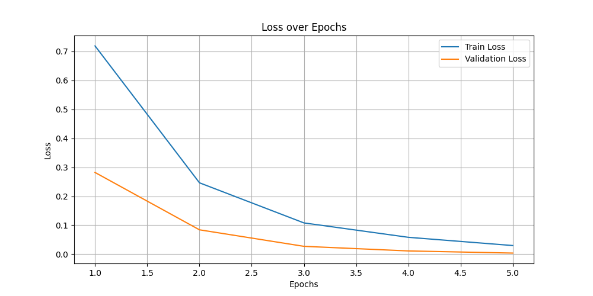
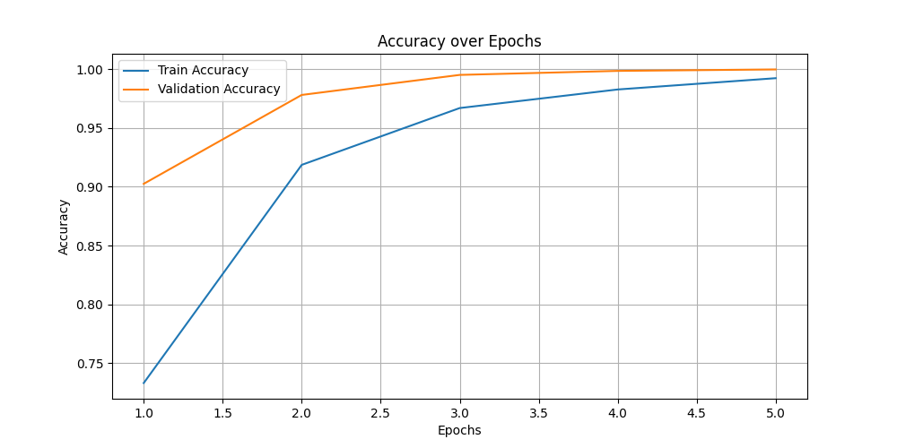

## Brief description
NoDFPT는 Not a Default Photos의 약자로,  
기존 스마트기기의 파편화된 로컬 기본 사진 앱을 대체하며,  
일일히 이미지를 분류하고 저장하기 보다는 자동으로 분류하는 편의 기능을 가진  
하나의 연속된개인 이미지 저장소를 제공하는 것을 목표로 합니다.

## Currently available features
- 이미지 자동 분류
- 사용자 정의 모델 학습

## How to install
1. 프로젝트를 클론 또는 다운로드 합니다.
2. 필요한 패키지를 설치합니다:  
  **GPU 사용시 CUDA, cuDNN등의 설정이 필요합니다!! (requirements.txt 확인요망)**
   
      ```
      pip install -r requirements.txt
      ```
3. 프로그램을 실행합니다.
   ```
   # cd /NoDFPT
   python no-dfpt.py
   ```

## How to use (CLI)

- **path**
   ```
   python no-dfpt.py path <YOUR_DESIRED_DIRECTORY>
   ```
   이미지 저장소 경로를 설정합니다.  
   선택한 디렉토리 내부에 디렉토리가 생성됩니다.
  - `/storage`  
  이미지 디렉토리 및 모델, loss.png, acc.png가 저장됩니다.  
  모델을 불러올 때도 storage 내에서 찾습니다. 
  - `/storage/dataset`  
  모델 학습에 사용되는 이미지 폴더입니다.  
  디렉토리 별 분류된 이미지를 이 디렉토리에 넣습니다.  
  각 디렉토리당 100장 이상을 추천합니다.  
  또한, 중첩된 디렉토리는 인식되지 않습니다.
     ```
    /storage/dataset/<YOURCLASSNAME0>
    /storage/dataset/<YOURCLASSNAME1>
    /storage/dataset/<YOURCLASSNAME2>
    ...
     ```
  - `/storage/classified`  
  모델을 사용하여 이미지를 분류하는 폴더입니다.  
  사용자가 따로 분류된 결과를 확인하고 수정할 수 있게 `dataset`과 분리되어 있습니다.  
  `dataset` 디렉토리와 내부구조와 동일하게 디렉토리를 생성하여 분류된 이미지를 저장합니다.  
  - `/storage/unclassified`  
  분류할 이미지를 넣는 디렉토리 입니다.  
  이미지 분류시 따로 디렉토리를 설정하지 않으면 이 디렉토리가 기본으로 사용됩니다.
  

- **train**
   ```
  python no-dfpt.py train <NUM_OF_EPOCHS>
   ```
  `dataset` 디렉토리를 기반으로 모델을 학습합니다.  
  `ResNet50`의 기본 가중치를 기반으로 전이 학습을 수행합니다.  
  출력 레이어를 `dataset` 디렉토리의 클래스로 지정하여 학습합니다.
  `state_dict` 모델로 `storage`에 저장되며, loss와 acc를 시각화한 그래프를 함께 저장합니다.  
  기본 `epoch`는 5회이며, 사용자 지정 횟수로 모델을 학습할 수 있습니다.  
    > sample 내 모델의 loss, acc 시각화 예시  
    
  

- **classify**
   ```
   python no-dfpt.py classify <IMAGES_DIRECTORY_TO_CLASSIFY>
   ```
  해당 디렉토리 내 이미지를 저장된 모델을 이용하여 분류합니다.  
  경로 미지정시 기본 경로는 `/storage/unclassified` 입니다.  


  
제가 학습시킨 `state-dict` 모델이 sample 폴더에 첨부되어 있으니 테스트 해보세요!  
제 dataset 디렉토리 구조는 이렇습니다!:  
```
/storage/dataset/<2D> - 2D 아트워크 그림
/storage/dataset/<Pic> - 사진
/storage/dataset/<meme> - 디스코드로 주고받을만한 유머 이미지
/storage/dataset/<emoticon> - 이모티콘으로 사용되는 정방형 이미지
```

## Features Currently working on
- GUI (Using Qt)
- DB 연동 기능
  - 이미지 - 태그 관계 등 구현
  - Google vision ai를 이용한 태그 추천 기능

## Features RoadMap
- 웹앱, 앱 - 서버 형태의 서비스 구현
- 이미지 뷰어 선택 기능, 현대적인 디자인의 갤러리 프로그램


## License
이 프로젝트는 MIT 라이선스 하에 배포됩니다.

